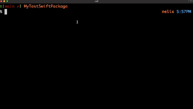

# nnex


**nnex** is a command-line tool that streamlines the distribution of Swift command-line executables via **Homebrew**.
With a single command, **nnex** handles it all:

- ✅ Build optimized universal binaries for ARM and Intel architectures.
- ✅ Strip symbols to reduce binary size.
- ✅ Create a new Homebrew tap if needed.
- ✅ Create a GitHub release and attach the binary asset.
- ✅ Generate and upload a Homebrew formula to your Homebrew tap.

Instead of manually managing taps and formulae, let **nnex** do the heavy lifting for you.
**nnex** also supports importing your own Homebrew taps to leverage existing setups.

**nnex** requires both **Homebrew** and the **GitHub CLI (gh)** to function properly. Please ensure they are installed and configured on your system before using **nnex** (you'll be prompted to install them if you use **nnex** without them).

**Stability Notice (v0.7.0)**  
`nnex` is functional and ready to use, but its features and API may evolve as it becomes more flexible and robust.  
Breaking changes are possible before reaching v1.0.0.  
Your feedback and suggestions are welcome as the project continues to improve!  

If you're curious about some of the struggles I went through to get SwiftData to work in a standalone Swift Package and in a CI workflow, I wrote an article outlining my journey that you can [check out here.](https://medium.com/@nikolai.nobadi/integrating-swiftdata-into-standalone-swift-packages-6cbcb45e5893)

## Table of Contents
- [Installation](#installation)
- [Commands](#commands)
  - [Brew Commands](#brew-commands)
    - [Publish](#publish)
  - [Config Commands](#config-commands)
- [Contributing](#contributing)
- [License](#license)
- [Acknowledgements](#acknowledgements)

## Installation
Install **nnex** with Homebrew

```bash
brew tap nikolainobadi/nntools
brew install nnex
```

Alternatively, you can install it directly:
```bash
brew install nikolainobadi/tap/nnex
```

Or, build from source:
```bash
git clone https://github.com/nikolainobadi/nnex.git
cd Nnex
swift build -c release
```

## Commands
**nnex** utilizes two subcommands, `Brew` and `Config`.

Brew commands are used to interact with Homebrew and GitHub, while Config commands are used to set preferences.

## Brew Commands

### Publish
The `publish` command is the most important command in **nnex**. It allows you to build a binary, create a new GitHub release, upload the binary, and optionally publish a Homebrew formula. This command streamlines the entire process of distributing your executable.



#### Basic Usage:
```swift
nnex brew publish
```
This command runs in the current directory and prompts you for any missing information.

To streamline the command and skip interactive prompts, include version, notes/notes-file, and a commit-message in the command.

```bash
nnex brew publish --version v1.0.0 --notes-file MyReleaseNotes.md --commit-message "Updated the formula for MyCoolTool" --skip-tests
```

If a required option is not specified, `nnex` will prompt you to enter it interactively.

If both `--notes` and `--notes-file` are provided, the command will throw an error since they are mutually exclusive.

For more details and advanced usage, refer to the [Command Reference](./docs/COMMANDS.md).

## Config Commands
To configure where any new Homebrew taps are created:
```bash
nnex config set-list-path /path/to/tap/folder
```

To display the current tap list folder path:
```bash
nnex config show-list-path
```

To open the tap list folder in Finder:
```bash
nnex config open-list-folder
```

To set the default binary build type:
```bash
nnex config set-build-type release
```

## Contributing

Contributions are welcome! If you'd like to improve a command, add new integrations, or fix bugs:

1. Fork the repo
2. Create a new branch
3. Submit a PR with a clear description

Issues and suggestions are also welcome via [GitHub Issues](https://github.com/nikolainobadi/nnex/issues).

## Acknowledgements

### Third-Party Libraries
- [SwiftArgumentParser](https://github.com/apple/swift-argument-parser)

### My Swift Packages
- [NnexKit](https://github.com/nikolainobadi/NnexKit)
- [SwiftPicker](https://github.com/nikolainobadi/SwiftPicker)

## License

`nnex` is available under the MIT license. See the [LICENSE](LICENSE) file for more information.
